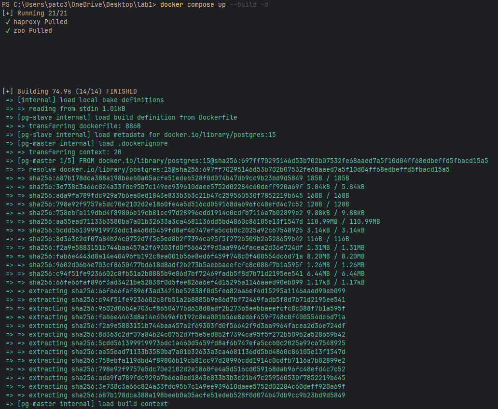
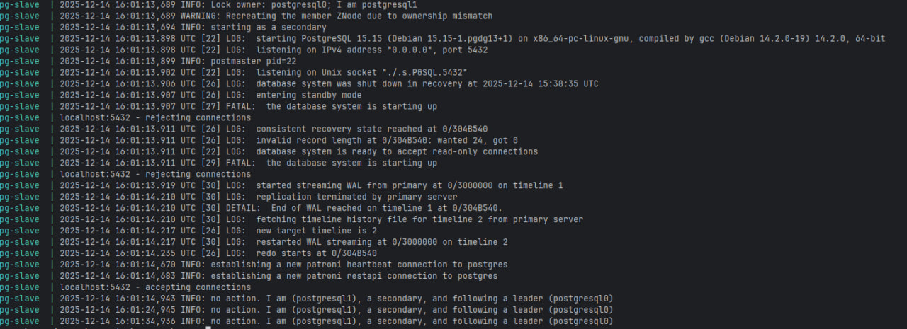
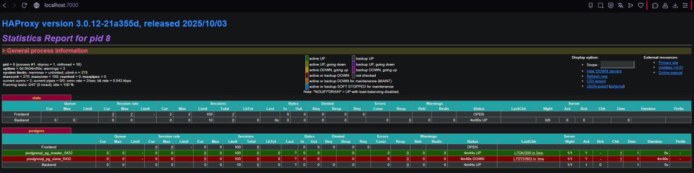
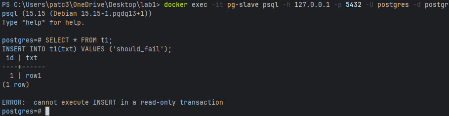
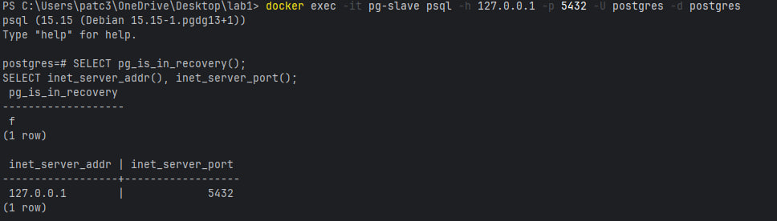
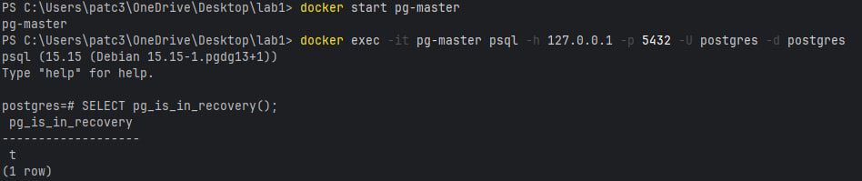

# ЛР 3(1) — HA Postgres Cluster (Postgres + Patroni + ZooKeeper + HAProxy)

---

**Dockerfile:**
```dockerfile
FROM postgres:15

RUN apt-get update -y && \
 apt-get install -y netcat-openbsd python3-pip curl python3-psycopg2 python3-venv iputils-ping

RUN python3 -m venv /opt/patroni-venv && \
 /opt/patroni-venv/bin/pip install --upgrade pip && \
 /opt/patroni-venv/bin/pip install patroni[zookeeper] psycopg2-binary

COPY postgres0.yml /postgres0.yml
COPY postgres1.yml /postgres1.yml
ENV PATH="/opt/patroni-venv/bin:$PATH"
USER postgres
```
**docker-compose.yml:**
```docker-compose.yml
services:
  pg-master:
    build: .
    image: local/postgres:patroni
    container_name: pg-master
    restart: always
    hostname: pg-master
    environment:
      POSTGRES_USER: postgres
      POSTGRES_PASSWORD: postgres
      PGDATA: "/var/lib/postgresql/data/pgdata"
    expose:
      - "8008"
    ports:
      - "5433:5432"
    volumes:
      - pg-master:/var/lib/postgresql/data
    command: patroni /postgres0.yml

  pg-slave:
    build: .
    image: local/postgres:patroni
    container_name: pg-slave
    restart: always
    hostname: pg-slave
    environment:
      POSTGRES_USER: postgres
      POSTGRES_PASSWORD: postgres
      PGDATA: "/var/lib/postgresql/data/pgdata"
    expose:
      - "8008"
    ports:
      - "5434:5432"
    volumes:
      - pg-slave:/var/lib/postgresql/data
    command: patroni /postgres1.yml

  zoo:
    image: confluentinc/cp-zookeeper:7.7.1
    container_name: zoo
    restart: always
    hostname: zoo
    ports:
      - "2181:2181"
    environment:
      ZOOKEEPER_CLIENT_PORT: 2181
      ZOOKEEPER_TICK_TIME: 2000

  haproxy:
    image: haproxy:3.0
    container_name: postgres_entrypoint
    restart: always
    ports:
      - "5432:5432"
      - "7000:7000"
    depends_on:
      - pg-master
      - pg-slave
      - zoo
    volumes:
      - ./haproxy.cfg:/usr/local/etc/haproxy/haproxy.cfg:ro

volumes:
  pg-master:
  pg-slave:
```
> 💡 Порты 8008 и 5432 вынесены в разные директивы, expose и ports. По сути, если записать 8008 в ports, то он тоже станет exposed. В чем разница?

- expose открывает порт только внутри docker-сети для других контейнеров, а ports дополнительно пробрасывает его на хост (localhost), делая доступным извне.

**postgres[0-1].yml:**
```postgres[0-1].yml
scope: my_cluster
name: postgresql0

restapi:
  listen: pg-master:8008
  connect_address: pg-master:8008

zookeeper:
  hosts:
    - zoo:2181

bootstrap:
  dcs:
    ttl: 30
    loop_wait: 10
    retry_timeout: 10
    maximum_lag_on_failover: 10485760
    master_start_timeout: 300
    synchronous_mode: true
  postgresql:
    use_pg_rewind: true
    use_slots: true
    parameters:
      wal_level: replica
      hot_standby: "on"
      wal_keep_segments: 8
      max_wal_senders: 10
      max_replication_slots: 10
      wal_log_hints: "on"
      archive_mode: "always"
      archive_timeout: 1800s
      archive_command: 'mkdir -p /tmp/wal_archive && test ! -f /tmp/wal_archive/%f && cp %p /tmp/wal_archive/%f'
  pg_hba:
    - host replication replicator 0.0.0.0/0 md5
    - host all all 0.0.0.0/0 md5

postgresql:
  listen: 0.0.0.0:5432
  connect_address: pg-master:5432
  data_dir: /var/lib/postgresql/data/postgresql0
  bin_dir: /usr/lib/postgresql/15/bin
  pgpass: /tmp/pgpass0
  authentication:
    replication:
      username: replicator
      password: rep-pass
    superuser:
      username: postgres
      password: postgres
  parameters:
    unix_socket_directories: '.'

watchdog:
  mode: off

tags:
  nofailover: false
  noloadbalance: false
  clonefrom: false
  nosync: false

```

**haproxy.cfg:**
```haproxy.cfg
global
  maxconn 100

defaults
  log global
  mode tcp
  retries 3
  timeout client 30m
  timeout connect 4s
  timeout server 30m
  timeout check 5s

listen stats
  mode http
  bind *:7000
  stats enable
  stats uri /


listen postgres
  bind *:5432
  option httpchk GET /master
  http-check expect status 200
  default-server inter 3s fall 3 rise 2 on-marked-down shutdown-sessions
  server postgresql_pg_master_5432 pg-master:5432 maxconn 100 check port 8008
  server postgresql_pg_slave_5432 pg-slave:5432 maxconn 100 check port 8008
```


### Поднимаем:
```
docker compose up --build -d
```



### Смотрим логи сервисов:
```
docker compose logs -f
```


## Проверяем роли Patroni (leader/replica)

```
docker compose logs --tail=200 pg-master
docker compose logs --tail=200 pg-slave
```




## Проверка HAProxy stats:
```
http://localhost:7000/
```


> 💡 При обычном перезапуске compose-проекта, будет ли сбилден заново образ?  
> **Ответ:** Нет.
>
> 💡 А если предварительно отредактировать `postgresX.yml`?  
> **Ответ:** Нет.
>
> 💡 А если изменить содержимое самого `Dockerfile`?  
> **Ответ:** Нет.
> 
> 💡 Почему?  
> Потому что `docker compose up -d` переиспользует уже собранный образ и не запускает сборку автоматически; изменения в `postgresX.yml` и `Dockerfile` попадают в образ только при явной пересборке (`docker compose build` или `docker compose up -d --build`).

## Проверим репликации:

Запишем данные в pg-master:


Проверим на реплике (pg-slave):



Данные созданные на лидере, присутствуют, значит репликация работает.
При выполнении INSERT получил ошибку cannot execute INSERT in a read-only transaction, т.к. нода находится в роли standby/replica и работает в режиме read-only.

Принудительно остановим текущую мастер-ноду pg-master
```
docker stop pg-master
```


После остановки pg-master Patroni выполнил failover. HAProxy начал считать pg-slave мастером (он единственный отвечает 200 на /master), поэтому pg-slave стал UP.

Команда подключения:
```
docker exec -it pg-slave psql -h 127.0.0.1 -p 5432 -U postgres -d postgres
```

SQL:
```
SELECT pg_is_in_recovery();
```


На pg-slave функция pg_is_in_recovery() вернула false, значит сервер работает как primary/master (не standby).

SQL:
```
INSERT INTO t1(txt) VALUES ('after_failover_write');
SELECT * FROM t1 ORDER BY id DESC LIMIT 5;
```


После failover запись на новую мастер-ноду успешна (INSERT выполняется без ошибки), данные доступны через SELECT.



После запуска контейнера pg-master я проверил его роль командой SELECT pg_is_in_recovery();.
Результат t (true) означает, что PostgreSQL запущен в режиме recovery, то есть нода работает как standby/replica и не является мастером (primary).
Следовательно, после возврата в кластер pg-master корректно присоединился как реплика, а роль мастера осталась за другой нодой.