# ЛР 1(2). Loki + Zabbix + Grafana

---


**docker-compose.yml:**
```docker-compose.yml
services:
  nextcloud:
    image: nextcloud:29.0.6
    container_name: nextcloud
    ports:
      - "8080:80"
    volumes:
      - nc-data:/var/www/html/data

  loki:
    image: grafana/loki:2.9.0
    container_name: loki
    ports:
      - "3100:3100"
    command: -config.file=/etc/loki/local-config.yaml

  promtail:
    image: grafana/promtail:2.9.0
    container_name: promtail
    volumes:
      - nc-data:/opt/nc_data
      - ./promtail_config.yml:/etc/promtail/config.yml
    command: -config.file=/etc/promtail/config.yml

  grafana:
    image: grafana/grafana:11.2.0
    container_name: grafana
    environment:
      - GF_PATHS_PROVISIONING=/etc/grafana/provisioning
      - GF_AUTH_ANONYMOUS_ENABLED=true
      - GF_AUTH_ANONYMOUS_ORG_ROLE=Admin
    command: /run.sh
    ports:
      - "3000:3000"

  postgres-zabbix:
    image: postgres:15
    container_name: postgres-zabbix
    environment:
      POSTGRES_USER: zabbix
      POSTGRES_PASSWORD: zabbix
      POSTGRES_DB: zabbix
    volumes:
      - zabbix-db:/var/lib/postgresql/data
    healthcheck:
      test: ["CMD", "pg_isready", "-U", "zabbix"]
      interval: 10s
      retries: 5
      start_period: 5s

  zabbix-server:
    image: zabbix/zabbix-server-pgsql:ubuntu-6.4-latest
    container_name: zabbix-back
    ports:
      - "10051:10051"
    depends_on:
      - postgres-zabbix
    environment:
      POSTGRES_USER: zabbix
      POSTGRES_PASSWORD: zabbix
      POSTGRES_DB: zabbix
      DB_SERVER_HOST: postgres-zabbix

  zabbix-web-nginx-pgsql:
    image: zabbix/zabbix-web-nginx-pgsql:ubuntu-6.4-latest
    container_name: zabbix-front
    ports:
      - "8082:8080"
    depends_on:
      - postgres-zabbix
    environment:
      POSTGRES_USER: zabbix
      POSTGRES_PASSWORD: zabbix
      POSTGRES_DB: zabbix
      DB_SERVER_HOST: postgres-zabbix
      ZBX_SERVER_HOST: zabbix-back

volumes:
  nc-data:
  zabbix-db:
```

**promtail_config.yml:**
```promtail_config.yml
server:
  http_listen_port: 9080
  grpc_listen_port: 0

positions:
  filename: /tmp/positions.yaml

clients:
  - url: http://loki:3100/loki/api/v1/push

scrape_configs:
  - job_name: system
    static_configs:
      - targets:
          - localhost
        labels:
          job: nextcloud_logs
          __path__: /opt/nc_data/*.log
```
### Поднимаем:
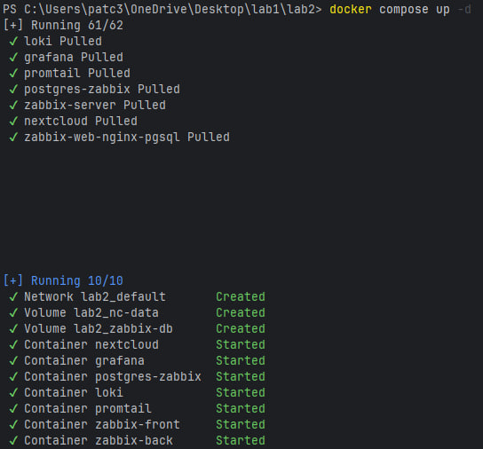

### Смотрим:
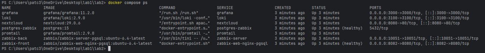

### Логинимся в nextcloud:
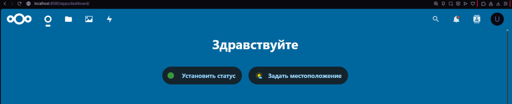

### Проверка Promtail (подцепил nextcloud.log)
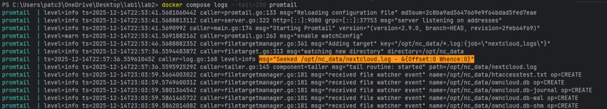

### Разрешить trusted_domains в Nextcloud:
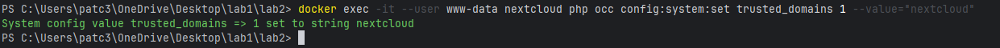

### Жив здоров:
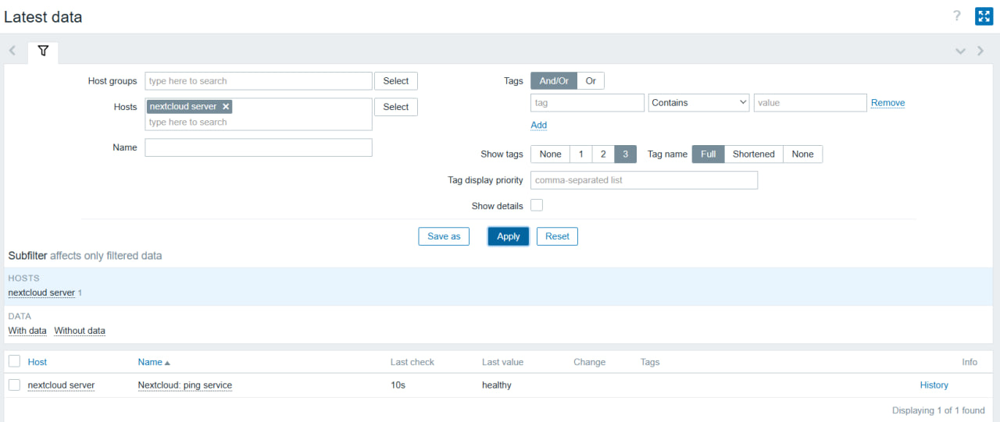

### Включаем maintenance mode:
```
docker exec -it --user www-data nextcloud php occ maintenance:mode --on
```
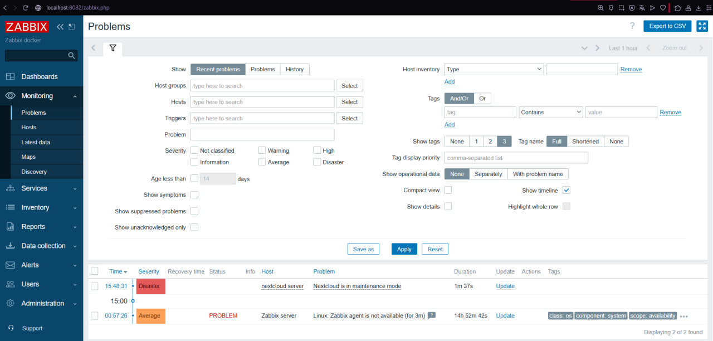

### Выключаем maintenance mode:
```
docker exec -it --user www-data nextcloud php occ maintenance:mode --off
```

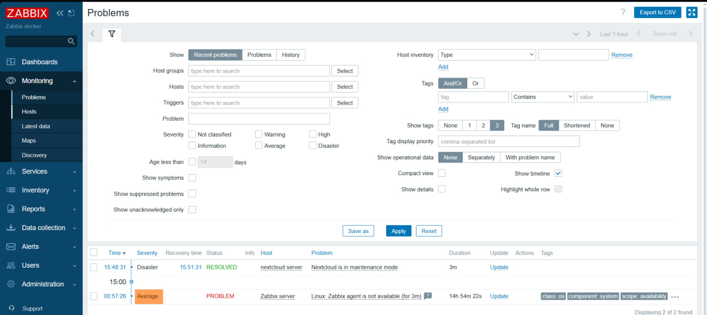

## Визуализация (Grafana)

#### Устанавливаем плагин Zabbix для Grafana(добавляем поддержку Zabbix как источника данных):

```
docker exec -it grafana bash -c "grafana cli plugins install alexanderzobnin-zabbix-app"
docker restart grafana
```
#### Активируем zabbix в grafana:
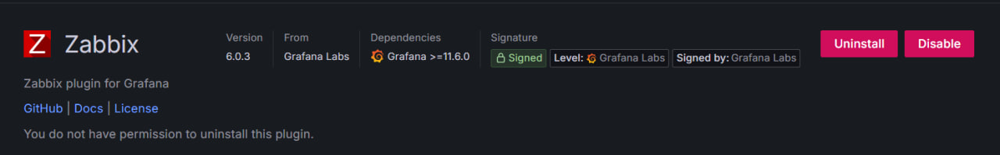
#### Подключение Loki в Grafana (Data source)
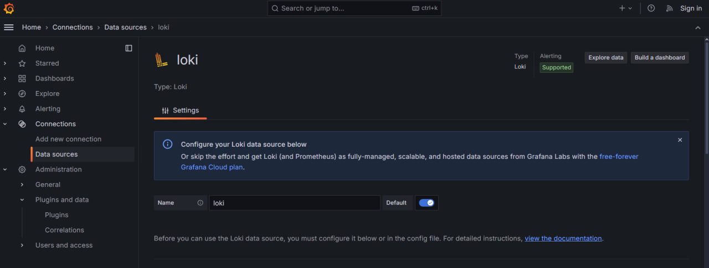
#### Подключение Zabbix в Grafana (Data source)
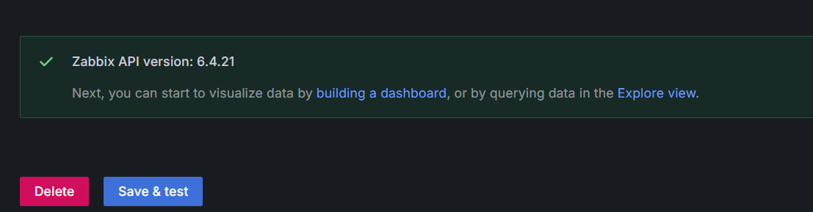

#### Смотрим Loki логи:

#### Смотрим Zabbix логи:
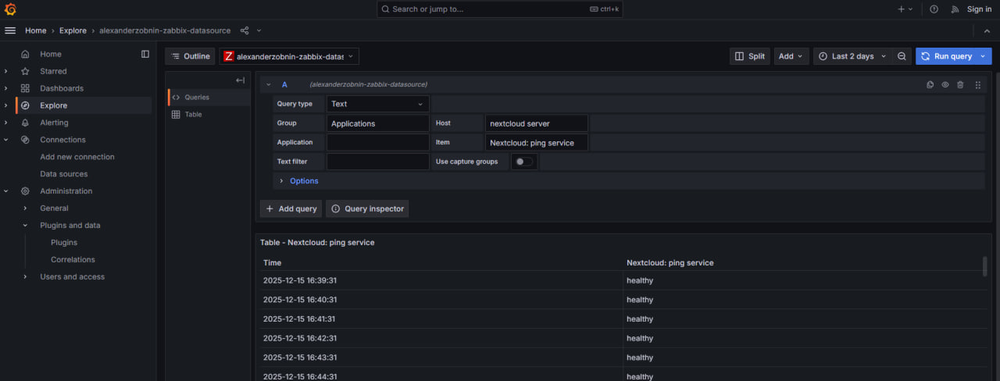

#### Посмотреть только warnings
```
{job="nextcloud_logs"} |= "level\":2"
```
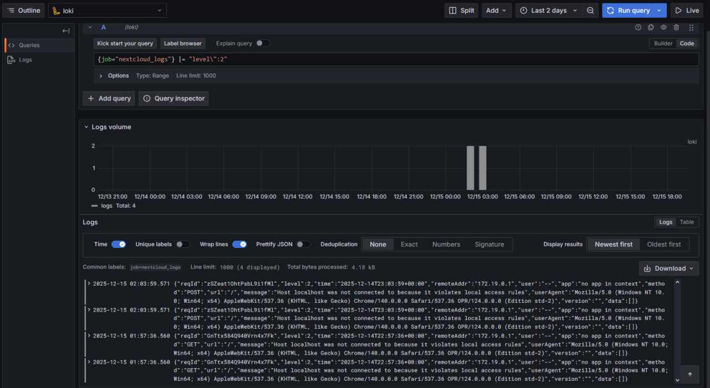

#### Отфильтровать по методу HTTP (GET/POST)
```
{job="nextcloud_logs"} |= "\"method\":\"POST\""
```
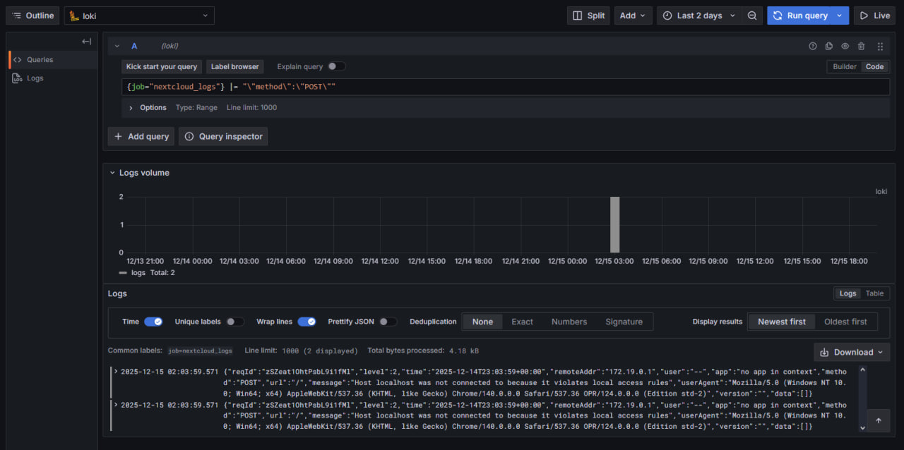

## Dashboards:
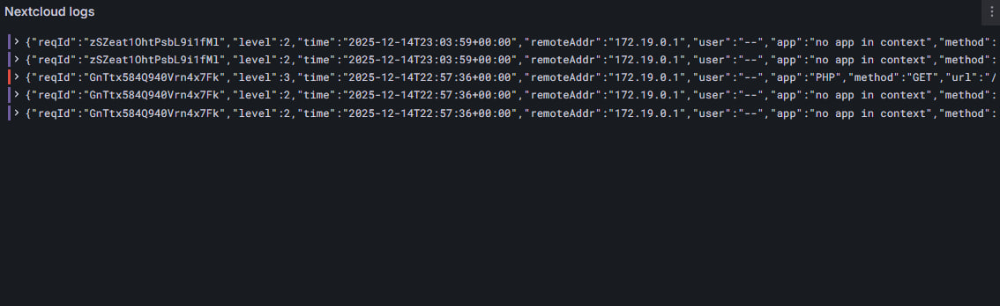
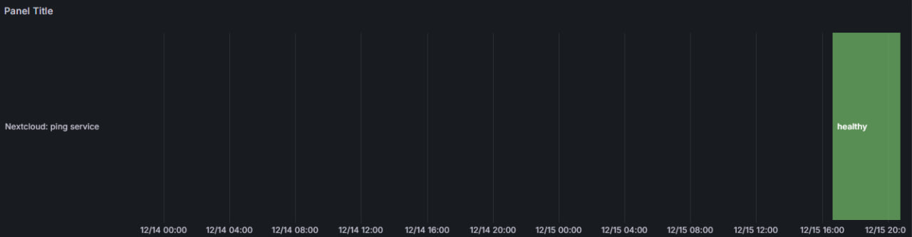

## Вопросы:
> 💡 Чем SLO отличается от SLA?
> 
> **Ответ:** SLO - это внутренняя цель команды по уровню надежности сервиса, которую используют для управления качеством. Например, SLO может быть "99,9% успешных запросов", а SLA - это публичное обещание клиенту с компенсацией при нарушении, например возврат части оплаты при падении ниже 99,5%
>
> 💡 Чем отличается инкрементальный бэкап от дифференциального?  
> 
> **Ответ:** Инкрементальный сохраняет изменения с последнего бэкапа любого типа, а дифференциальный - все изменения с момента последнего полного бэкапа.
>
> 💡 В чем разница между мониторингом и observability?
> 
> **Ответ:** Мониторинг отвечает на вопрос "что сломалось", используя заранее настроенные метрики, пороги и алерты, например сигнализируя о росте 500-х ошибок. Observability отвечает на вопрос "почему сломалось", позволяя без заранее известных сценариев проанализировать логи, метрики и трейсы и найти корневую причину проблемы.
>
