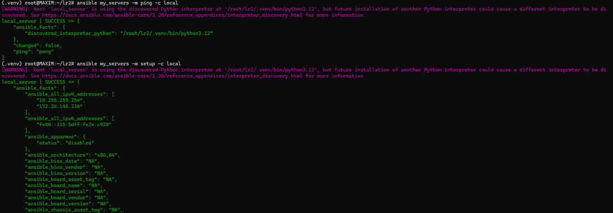
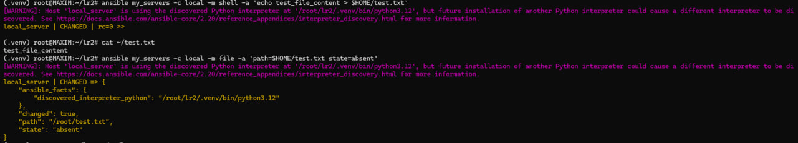
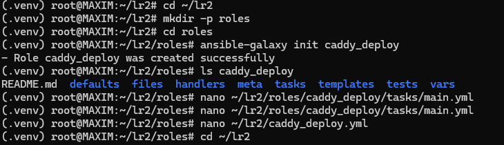
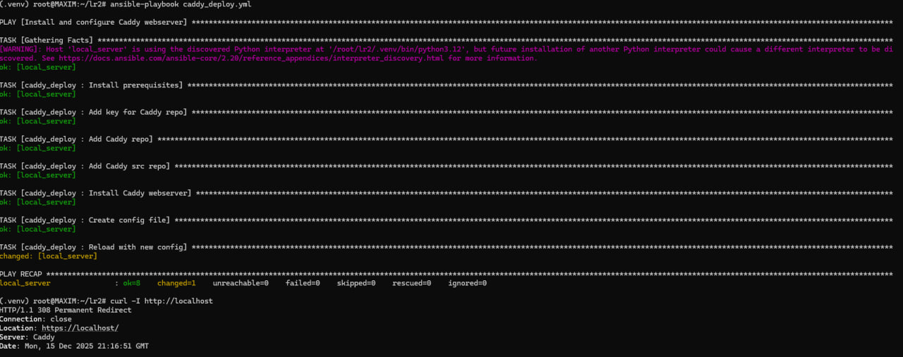
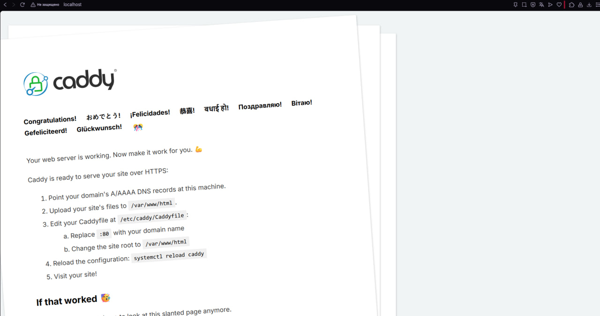
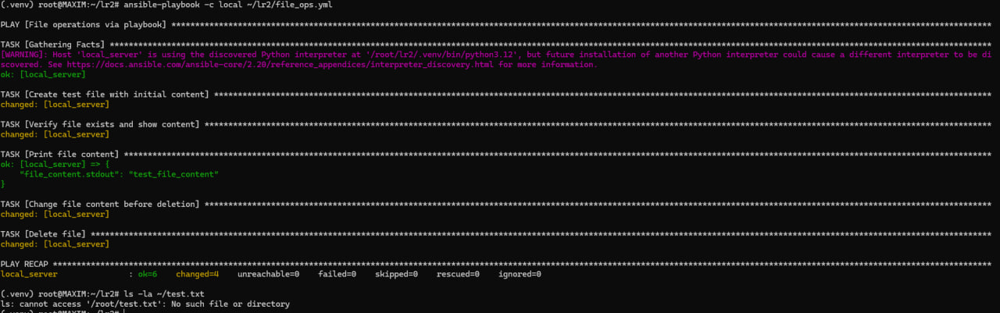
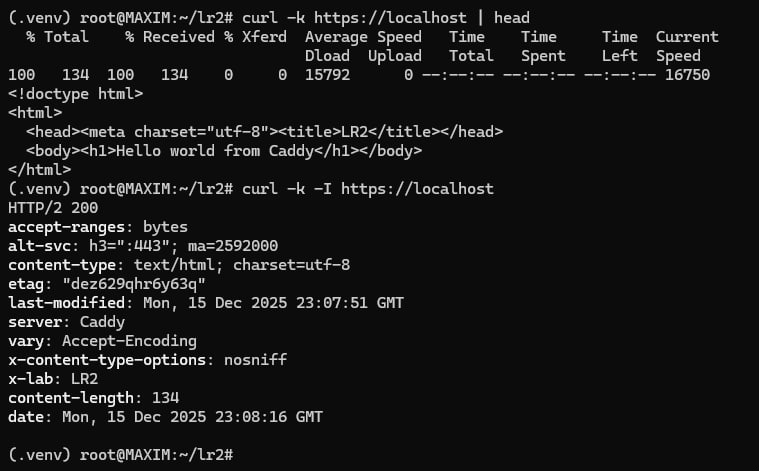

# ЛР 2. Ansible + Caddy
#### Проверка подключения Ansible к целевому хосту и сбор системной информации:


#### Создание, проверка и удаление файла:

#### Инициализация роли caddy_deploy и подготовка playbook/tasks для установки и настройки Caddy:


**roles/caddy_deploy/tasks/main.yml:**
```roles/caddy_deploy/tasks/main.yml
---
- name: Install prerequisites
  apt:
    pkg:
      - debian-keyring
      - debian-archive-keyring
      - apt-transport-https
      - curl
      - gnupg
      - python3-apt
    update_cache: yes
    state: present

- name: Add key for Caddy repo
  apt_key:
    url: https://dl.cloudsmith.io/public/caddy/stable/gpg.key
    state: present
    keyring: /usr/share/keyrings/caddy-stable-archive-keyring.gpg

- name: Add Caddy repo
  apt_repository:
    repo: "deb [signed-by=/usr/share/keyrings/caddy-stable-archive-keyring.gpg] https://dl.cloudsmith.io/public/caddy/stable/deb/debian any-version main"
    state: present
    filename: caddy-stable

- name: Add Caddy src repo
  apt_repository:
    repo: "deb-src [signed-by=/usr/share/keyrings/caddy-stable-archive-keyring.gpg] https://dl.cloudsmith.io/public/caddy/stable/deb/debian any-version main"
    state: present
    filename: caddy-stable

- name: Install Caddy webserver
  apt:
    name: caddy
    update_cache: yes
    state: present
- name: Create config file
  template:
    src: templates/Caddyfile.j2
    dest: /etc/caddy/Caddyfile

- name: Reload with new config
  service:
    name: caddy
    state: reloaded
```
**caddy_deploy.yml:**
```caddy_deploy.yml
---
- name: Install and configure Caddy webserver
  hosts: my_servers
  connection: local
  become: true
  roles:
    - caddy_deploy
```

#### Плейбук caddy_deploy.yml отработал без ошибок: Caddy установлен, конфиг применён и сервис перезагружен. Проверка curl показала редирект с HTTP на HTTPS (308), значит вебсервер отвечает

#### Проверка работы Caddy


## Задание 1

Плейбук реализует последовательность операций: создаёт тестовый файл, считывает и выводит его содержимое, затем изменяет содержимое и удаляет файл. По результату выполнения плейбука все шаги выполнены успешно (ошибок нет)


**file_ops.yml:**
```file_ops.yml
---
- name: File operations via playbook
  hosts: my_servers
  connection: local
  gather_facts: true

  tasks:
    - name: Create test file with initial content
      copy:
      dest: "{{ ansible_facts['env']['HOME'] }}/test.txt"
      content: "test_file_content\n"

    - name: Verify file exists and show content
      command: cat "{{ ansible_facts['env']['HOME'] }}/test.txt"
      register: file_content

    - name: Print file content
      debug:
      var: file_content.stdout

    - name: Change file content before deletion
      copy:
      dest: "{{ ansible_facts['env']['HOME'] }}/test.txt"
      content: "updated_content\n"

    - name: Delete file
      file:
      path: "{{ ansible_facts['env']['HOME'] }}/test.txt"
      state: absent
```

## Задание 2
Проверка расширенной конфигурации Caddy: отображается кастомная страница и отдаются добавленные HTTP-заголовки (X-Lab, X-Content-Type-Options).



После применения роли Caddy раздаёт нашу страницу Hello world from Caddy. Также видно, что сервер возвращает настроенные заголовки, значит изменения в Caddyfile применились.